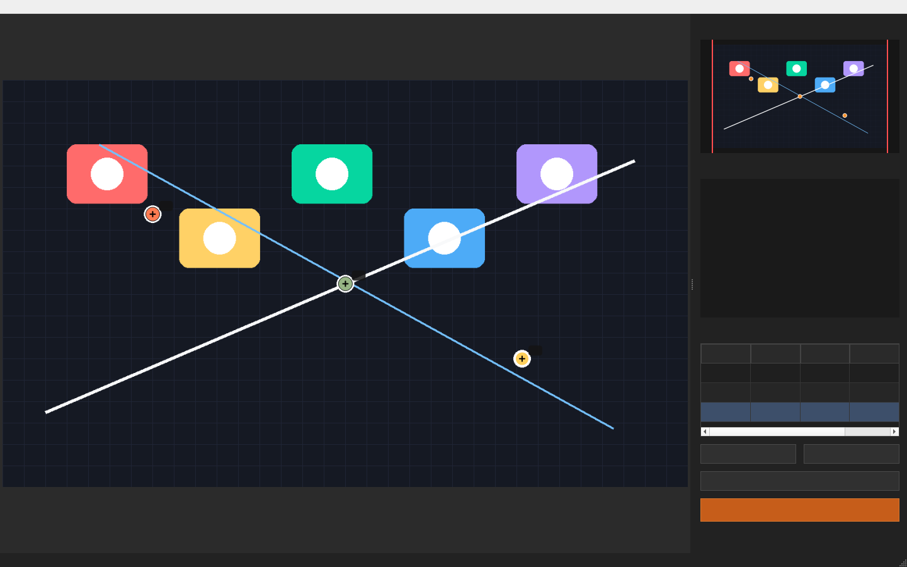

# PixPoint

Current version: `v1.2`

A tiny local desktop tool for picking exact pixel coordinates from images.

PixPoint is built with PyQt5. It is useful for developers, designers, computer vision experiments, UI automation, image inspection, and lightweight annotation workflows where you need accurate original-image coordinates.

[中文说明](README.zh-CN.md)



## Highlights

- Pick exact pixel coordinates from the original image.
- Zoom with the mouse wheel, centered on the cursor position.
- Pan with right-drag or `Space` + left-drag.
- Inspect pixels with a built-in magnifier.
- Show a pixel grid at high zoom levels.
- Add, edit, delete, and focus saved points.
- Export point coordinates as `JSON`.
- Export the current image as Excel pixel art (`.xlsx`).
- Runs locally on your computer. No upload, no cloud processing, no external API.

## Use Cases

- Pixel coordinate picking for development and debugging.
- Lightweight image annotation.
- UI automation coordinate inspection.
- Computer vision dataset preparation helpers.
- Map, sprite, screenshot, and large-image inspection.
- Fun Excel pixel art export.

## Install

PixPoint requires Python 3 and the dependencies listed in `requirements.txt`.

If you only want to use the Windows app, download the packaged build from the latest release:

- [Download PixPoint v1.2 for Windows](https://github.com/flowfish/pixpoint/releases/tag/v1.2)

If you want to run PixPoint from source, clone the repository first:

```bash
git clone https://github.com/flowfish/pixpoint.git
cd pixpoint
```

Create a virtual environment:

```bash
python -m venv .venv
```

Activate it on Windows:

```bash
.venv\Scripts\activate
```

Activate it on macOS / Linux:

```bash
source .venv/bin/activate
```

Install dependencies:

```bash
pip install -r requirements.txt
```

## Run

Start the app:

```bash
python main.py
```

You can also open an image directly from the command line:

```bash
python main.py your_image.png
```

## Windows Build

A Windows executable can be packaged from this project. The current local build is `ImgPosition V1.2.exe`.

For public distribution, publish the executable as a GitHub Release asset rather than committing it directly to the repository.

## How To Use

Open an image from `File -> Open Image...`.

Move the mouse over the image to see the original pixel coordinate in the status bar.

Use the mouse wheel to zoom in and out. The zoom operation is anchored around the cursor, so it feels natural when inspecting details.

Pan the canvas by dragging with the right mouse button, or by holding `Space` and dragging with the left mouse button.

Click the image to add a point. Saved points are listed in the right-side `Points` table with `Index / X / Y / Color`.

Select a point in the table to focus the canvas on that location. You can edit or delete selected points from the side panel.

Save coordinates from `File -> Save Coordinates...`.

Export Excel pixel art from `File -> Export Pixel To Excel...`.

## JSON Export Example

```json
{
  "image_path": "demo.png",
  "image_size": {
    "width": 1920,
    "height": 1080
  },
  "points": [
    {
      "index": 1,
      "x": 320,
      "y": 240,
      "color": "#ff6b6b"
    }
  ]
}
```

## Excel Pixel Art Export

PixPoint can map an image to Excel cells and export it as an `.xlsx` file.

To keep export performance reasonable, the current build limits the export size to `2560 x 2560` cells and no more than `4,194,304` total cells.

## Privacy

PixPoint is a local desktop application:

- Your images stay on your machine.
- The app does not upload files.
- The app does not call external APIs.
- The app does not require an internet connection.

## Roadmap Ideas

- CSV export.
- Rectangle and polygon annotation.
- YOLO / COCO export.
- Batch image workflows.
- Keyboard shortcuts for faster labeling.

## License

License has not been selected yet.
